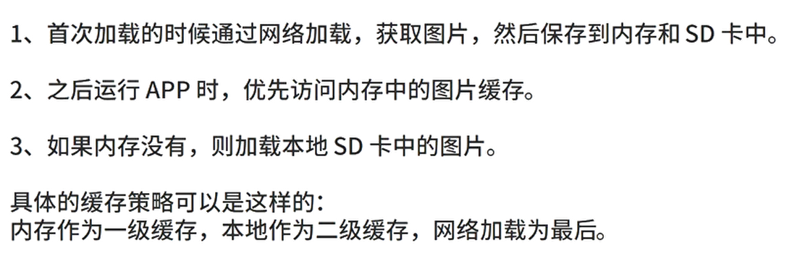
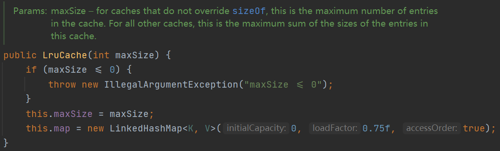
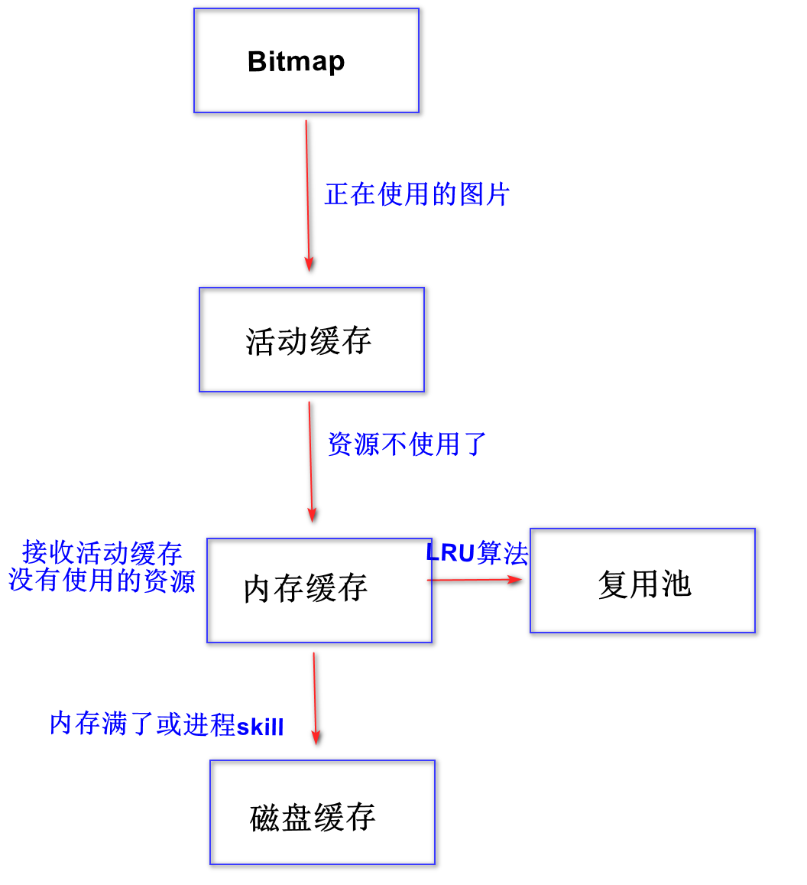
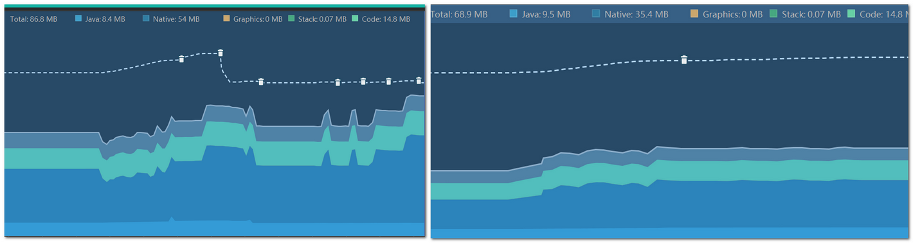

# AndGlideTalk
Android Glide

模块[CustomGlide] 仿Glide自实现图片加载框架，包含生命周期管理，活动缓存，内存缓存，硬盘缓存和内存复用池。
模块[MemoryReusePool] 单独模块，内存复用池的测试。

0. Glide框架优势:
 * 可配置度高，自适应度高;
 * 支持多种数据源，本地，网路，assets gif在glide是支持的;3高效缓存，支持memory和disk图片缓存，默认使用二级缓存4高效处理Bitmap:使用Bitmap pool复用Bitmap
 * 图片加载过程可以监听
 * 生命周期集成到Glide

1. Glide手写实现之资源封装

    资源封装
    Key   -- 对Value的唯一性进行描述
    Value -- Bitmap的封装(+1, -1, 释放)

---
2. Glide手写实现之活动缓存
2.1回收机制：GC扫描的时候回收,移除容器（GC被动移除）（弱引用）
2.2容器管理方式：资源的封装 Key  ----- （弱引用<Value>)
2.3手动移除的区分
2.4关闭线程
2.5Value监听加入

---
3. Glide手写实现之内存缓存（LRU算法）
LRU算法：最少使用算法，最近没有使用的元素，会自动被移除掉

职责：
活动缓存：给正在使用的资源存储的，弱引用,正在使用的缓存。使用计数算法
内存缓存：为了减少磁盘读取，为第二次缓存服务，LRU算法，最近没有使用的元素，会自动被移除掉

* **内存缓存LruCache 类：**
利用LinkedHashMap<K, V>，

LinkedHashMap: true  ==拥有访问排序的功能 (最少使用元素算法-LRU算法)

put：
    1.如果是重复的key，会被移除掉一个
    key=15151511551
    previous = key=15151511551
    entryRemoved
    2.trimToSize 移除哪些最近没有使用的元素 ---》 entryRemoved

---
4. Glide手写实现之磁盘缓存

以文件形式保存在磁盘，保存时间比较长
也是LRU算法， Android官方没有提供相关Api,  
三方提供了DiskLruCache:[https://github.com/JakeWharton/DiskLruCache](https://github.com/JakeWharton/DiskLruCache)
仍然是LRU算法，LinkHashMap访问排序

----
5. Glide手写实现之生命周期

生命周期的管理：Application不能去管理，FragmentActivity可以去管理，Activity也可以去管理
管理的方式：在Activity组件上 附件Fragment，通过Fragment监听组件的生命周期

为什么发送一次Handler？
Android基于Handler消息的，LAUNCH_ACTIVITY，为了使fragment不要再在排队中
---
6. Glide手写实现之加载图片
加载资源 --> 缓存 --->网络/SD/ 加载资源 成功后 --> 保存到缓存中

* 总结：
第一次的时候，去网络下载图片，保存到磁盘缓存中（/sd/disk_lru_cache_dir/key）
第二次的时候，直接再活动缓存中，找到了资源
第三次的时候，直接再活动缓存中，找到了资源
第N次的时候，直接再活动缓存中，找到了资源

把Activity给返回回去的时候，进行释放，活动缓存的释放
又一次加载的时候，从内存缓存中获取了
再下一次加载的时候，就是从活动缓存获取了

把App给杀掉
整个活动缓存，整个内存缓存，都没有了
所以从磁盘缓存中获取

---
* LRU
1.活动缓存，HashMap管理的，用到了弱引用去回收移除 ----> 活动缓存（Value没有被使用了）移除后 交给 内存缓存
2.内存缓存，内存缓存作为第二道防线，LRU算法的
3.磁盘缓存，缓存中最后一道防线，保存手机存储的,LRU算法的

### 内存复用池

图片大小： 宽 * 高 * 每个像素点大小（跟Bitmap格式有关）

* 复用池 和 内存缓存机制，没有直接关系
* 内存缓存: 缓存的是资源 ，比如活动缓存，内存缓存， 磁盘缓存 ，缓存的是图片资源。
* 复用池复用的是内存，避免频繁申请内存空间，造成内存抖动和内存碎片的问题。

复用以LRU方式保存

复用的标准，必须满足2个条件，才能复用bitmap的内存
1.bitmap.inMutable = true
2.bitmap大小要小于LruCache的maxSize()

使用了内存复用之后内存抖动分布对比：

